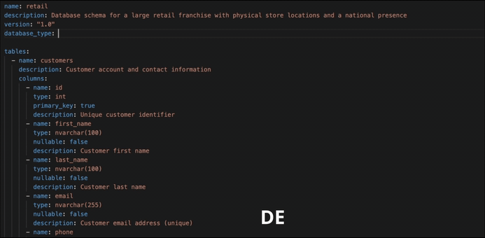

# nlseek

A natural language to Query converter.



## Installation

```bash
# Using uv
uv pip install nlseek

# Or install from source
uv pip install -e .
```

## Development

```bash
# Clone the repository
git clone https://github.com/leaninnovationlabs/nlseek.git
cd nlseek

# Create virtual environment and install dependencies
uv venv
source .venv/bin/activate  # On Windows: .venv\Scripts\activate
uv pip install -e ".[dev]"

# Run tests
pytest

# Run linter
ruff check src tests
ruff format src tests

# Type checking
mypy src


# Build the package
uv run python -m build
uv run twine check dist/*

```

## Usage

### Load domain from file

See [examples/domains/ecommerce.yaml](examples/domains/ecommerce.yaml) for a complete domain schema example.

```python
from nlseek import DomainLoader, QueryResolver

# Load a domain schema from YAML files
loader = DomainLoader("/path/to/domains")
domain = loader.get_domain("ecommerce")

# Create a query resolver
resolver = QueryResolver(domain)

# Convert natural language to SQL
result = resolver.resolve("Show me all orders from last week")
print(result.query)        # The generated SQL query
print(result.explanation)  # Explanation of the query
print(result.tables_used)  # Tables referenced
print(result.entities)     # Entities identified from the question mapped to columns
print(result.filters)      # Filter conditions extracted from the WHERE clause
```

### Load domain from JSON string

```python
from nlseek import DomainLoader, QueryResolver

# Create a loader without a file path
loader = DomainLoader()

# Register a domain from a JSON string
loader.register_domain('''
{
    "name": "mydb",
    "database_type": "postgres",
    "tables": [
        {
            "name": "users",
            "columns": [
                {"name": "id", "type": "integer", "primary_key": true},
                {"name": "email", "type": "varchar(255)"}
            ]
        }
    ]
}
''')

# Use the registered domain
domain = loader.get_domain("mydb")
resolver = QueryResolver(domain)
result = resolver.resolve("List all users")
```

### Generate domain from Pydantic models

```python
from pydantic import BaseModel, Field
from nlseek import DomainLoader, QueryResolver

# Define your models (works with Pydantic, SQLModel, etc.)
class User(BaseModel):
    """User account information."""
    id: int
    email: str
    name: str | None = None

class Order(BaseModel):
    """Customer order."""
    id: int
    user_id: int  # Auto-detected as FK to users.id
    total: float = Field(description="Order total in USD")

# Generate domain from models
loader = DomainLoader()
loader.register_from_models(
    name="mydb",
    models=[User, Order],
    database_type="postgres",
)

# Use the generated domain
domain = loader.get_domain("mydb")
resolver = QueryResolver(domain)
result = resolver.resolve("Show orders for user with email john@example.com")
```

The generator automatically:
- Converts class names to table names (`User` -> `users`, `OrderItem` -> `order_items`)
- Maps Python types to SQL types (`int` -> `integer`, `str` -> `varchar(255)`, etc.)
- Detects primary keys (fields named `id`)
- Infers relationships from foreign key columns (`user_id` -> `users.id`)
- Extracts descriptions from docstrings and `Field(description=...)`

### Configuring the AI Model

By default, `QueryResolver` uses Claude Opus 4. To use a different model, pass a `ResolverConfig`:

```python
from nlseek import QueryResolver, ResolverConfig

config = ResolverConfig(model="anthropic:claude-sonnet-4-20250514")
resolver = QueryResolver(domain, config=config)
```

Any model identifier supported by [pydantic-ai](https://ai.pydantic.dev/models/) can be used but need to have the corresponding API key in the `.env` file.

### Quick Demo

The demo loads the [examples/domains/ecommerce.yaml](examples/domains/ecommerce.yaml) schema (customers, products, orders, etc.) and prints the generated SQL, explanation, tables used, entities, and filters.

```bash
# More examples
uv run tests/demo.py "Top 5 customers by total spending"
uv run tests/demo.py "Revenue by category for delivered orders"

# Use a different model
uv run tests/demo.py --model "anthropic:claude-sonnet-4-20250514" "Products with low stock"
```

## Response Fields

Each `SQLQueryResult` includes:

| Field | Type | Description |
|-------|------|-------------|
| `query_id` | `UUID` | Unique identifier for this query result |
| `query` | `str` | The generated SQL query |
| `explanation` | `str` | Brief explanation of what the query does |
| `tables_used` | `list[str]` | Tables referenced in the query |
| `entities` | `dict[str, list[str]]` | Entities from the question mapped to the columns they match |
| `filters` | `list[FilterCondition]` | Filter conditions extracted from the WHERE clause |

### Entities

Maps domain-specific values from the user's question to the database columns they were matched against. For example, for the question *"Get me information about iphone under electronics"*:

```json
{
  "iphone": ["products.name", "products.description"],
  "electronics": ["categories.name"]
}
```

### Filters

Each `FilterCondition` contains:

| Field | Type | Description |
|-------|------|-------------|
| `table` | `str` | Table name (e.g. `products`) |
| `attribute` | `str` | Column name (e.g. `name`) |
| `operator` | `str` | SQL operator (e.g. `LIKE`, `=`, `>`, `IN`, `BETWEEN`) |
| `value` | `str` | The filter value (e.g. `iphone`, `electronics`) |

For the same query above, the filters would be:

```json
[
  {"table": "products", "attribute": "name", "operator": "LIKE", "value": "iphone"},
  {"table": "categories", "attribute": "name", "operator": "=", "value": "electronics"}
]
```

## Database Support
Supports the following Query format right now
- mysql
- postgres
- oracle
- ansi sql

## Environment Setup

Create a `.env` file with your Anthropic API key:

```
ANTHROPIC_API_KEY=your-api-key-here
```

## License

MIT
